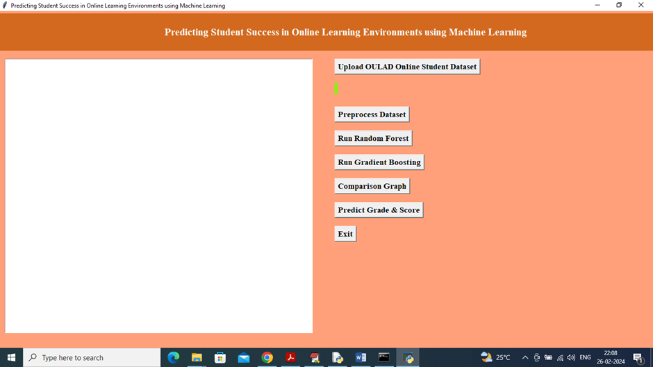
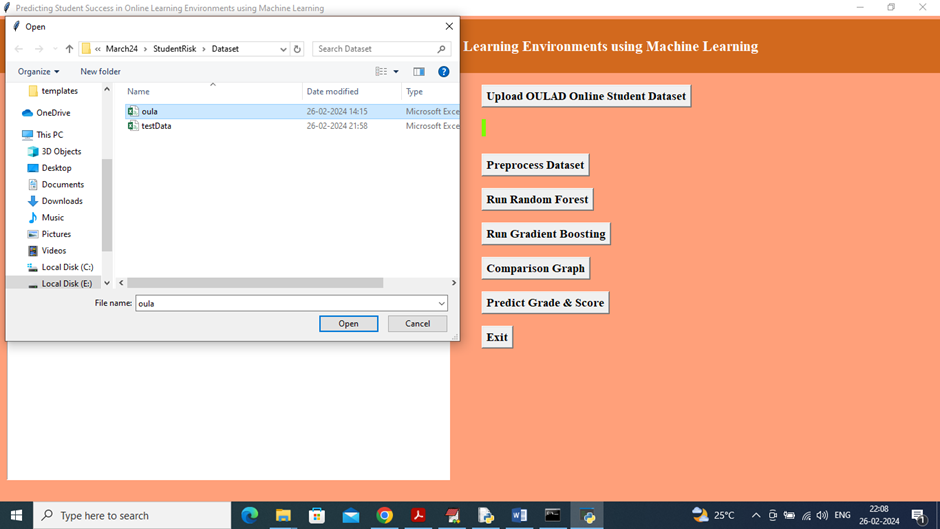
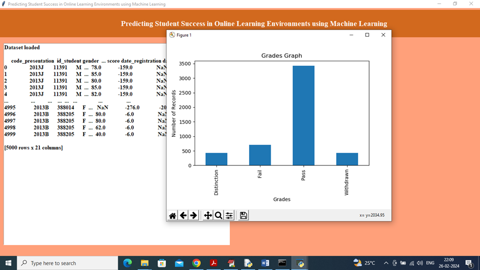
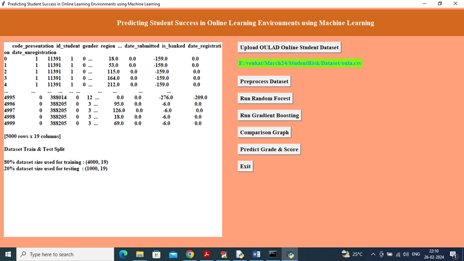
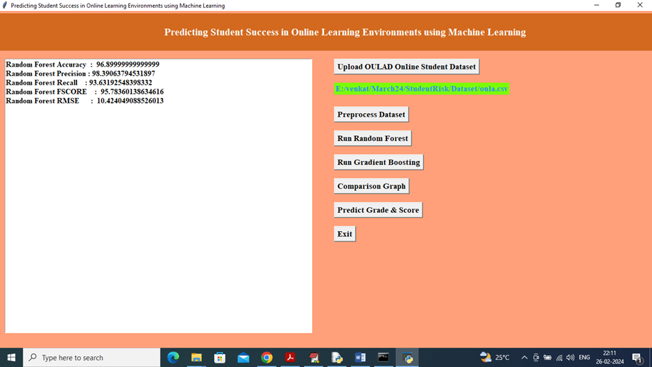
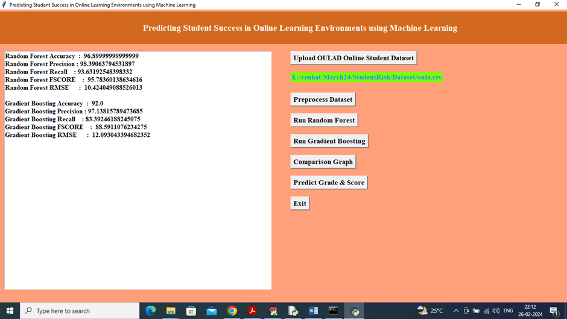
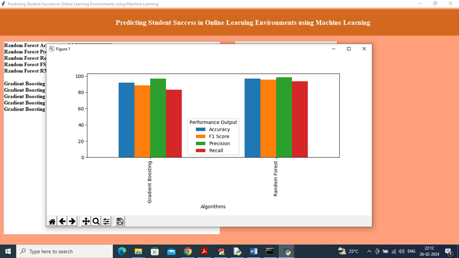
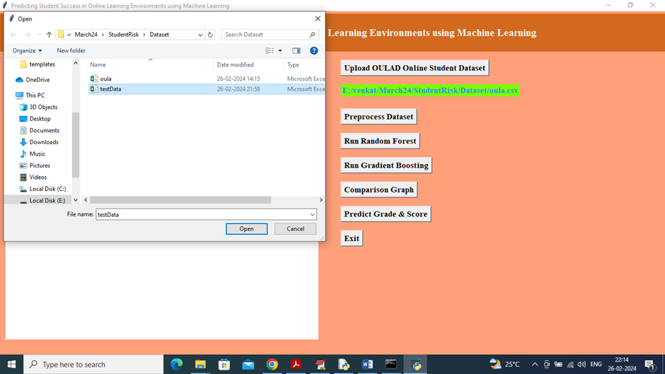
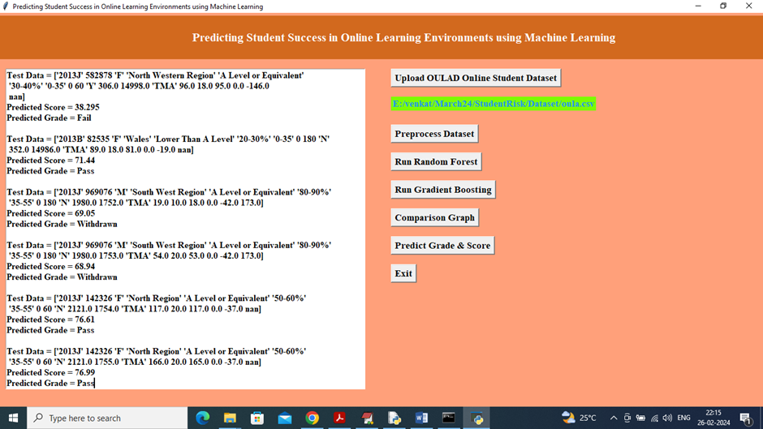

````markdown
# Predicting Student Success in Online Learning Environments using Machine Learning

This project applies machine learning techniques to predict students' academic outcomes (final grades and scores) based on historical data from the **Open University Learning Analytics Dataset (OULAD)**. A graphical user interface (GUI) built with Tkinter allows users to load data, train models, and visualize predictions with ease.

---

## 🎯 Features

- 📂 Upload and preview the OULAD dataset
- 🧹 Preprocess data using label encoding and missing value handling
- 🤖 Train and evaluate:
  - Random Forest Classifier & Regressor
  - Gradient Boosting Classifier & Regressor
- 📊 View performance metrics (Accuracy, Precision, Recall, F1 Score, RMSE)
- 📈 Visualize algorithm comparisons with bar charts
- 🔮 Predict student grade and score from new input data

---

## 🛠️ Installation

### 1. Clone the Repository

```bash
git clone https://github.com/Prajwalreddy9/Predicting-Student-Success-in-Online-Learning-Environments-using-Machine-Learning.git
cd Predicting-Student-Success-in-Online-Learning-Environments-using-Machine-Learning
````

### 2. Install Dependencies

Create a virtual environment (optional but recommended):

```bash
python -m venv venv
source venv/bin/activate  # On Windows: venv\Scripts\activate
```

Then install the required packages:

```bash
pip install -r requirements.txt
```

>

---

## 🚀 How to Run

Start the GUI by executing:

```bash
python Main.py
```

Once the app launches, you can:

* **Upload OULAD Dataset** – Load your dataset file (CSV)
* **Preprocess Dataset** – Clean and encode data, then split for training/testing
* **Run Random Forest** – Train and test the Random Forest model
* **Run Gradient Boosting** – Train and test the Gradient Boosting model
* **Comparison Graph** – View a visual comparison of model performance
* **Predict Grade & Score** – Make predictions using a new dataset
* **Exit** – Close the app

---

## 📁 Project Structure

```
PREDICTING-STUDENT-SUCCESS-IN-ONLINE-LEARNING/
├── Dataset/ # Folder to store your dataset CSV files
│ └── DatasetLink.txt # Optional text file with dataset source info or links
├── screenshots/ # Folder containing GUI screenshots for documentation
│ ├── 1_home_screen.png
│ ├── 2_upload_dataset.png
│ ├── 3_grade_distribution.png
│ ├── 4_preprocessing.png
│ ├── 5_random_forest.png
│ ├── 6_gradient_boosting.png
│ ├── 7_comparison_graph.png
│ ├── 8_upload_testdata.png
│ └── 9_prediction_output.png
├── Main.py # Main Python script with GUI and ML logic
├── README.md # Project documentation (this file)
└── requirements.txt # List of Python dependencies
```

---

## 📊 Example Metrics

After training models, the app displays metrics such as:

* Accuracy
* Precision
* Recall
* F1-Score
* RMSE (Root Mean Squared Error)

These are shown in the GUI and visualized using bar plots.

---

## 🧾 Dataset Info

You can download the dataset from [Open University Learning Analytics Dataset (OULAD)](https://analyse.kmi.open.ac.uk/open_dataset).

Place the dataset CSV file in the `Dataset/` folder or browse to it using the GUI file picker.

---

## 📷 Screenshots

### 1. Home Screen
Main GUI layout with available functions.


### 2. Uploading Dataset
File picker window to select and load the OULAD dataset.


### 3. Grade Distribution Visualization
Dataset is loaded, and grade distribution is shown as a bar chart.


### 4. Preprocessing the Dataset
Non-numeric values are encoded and data is split into training (80%) and testing (20%) sets.


### 5. Running Random Forest
Performance metrics of the Random Forest model including Accuracy, Precision, Recall, F1-Score, and RMSE.


### 6. Running Gradient Boosting
Performance metrics of the Gradient Boosting model.


### 7. Algorithm Comparison
Bar chart comparing both algorithms across multiple performance metrics.


### 8. Uploading Test Data
Selecting a test dataset for prediction.


### 9. Grade & Score Predictions
Predicted grades and scores displayed for each test record.


